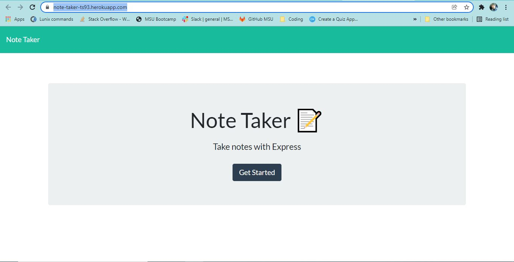
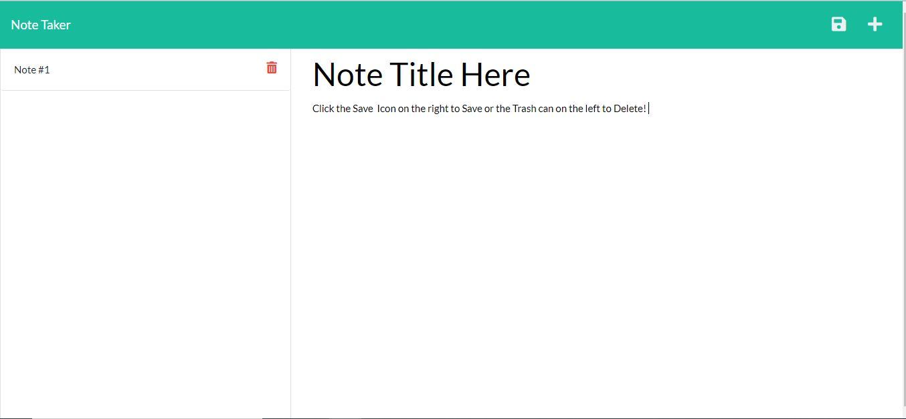

# Note Taker

[Click me to go to the Application!](https://note-taker-ts93.herokuapp.com/)

## Description

This is an application to Create, save them for later, and delete them as needed.

## Table of Contents

1. [INSTALLATION](#Installation)
2. [USAGE](#Usage)
3. [TESTS](#Tests)
4. [QUESTIONS](#Questions)
65. [LICENSE](#License)

## Installation

Once the code has been cloned, change to the public directory and run npm i to install the needed dependencies.

## Usage

Take Notes and Save/Delete them as needed.

## Technologies Used

* Javascript 
* HTML 
* CSS 
* Node JS 

## Tests

No tests were used for this application.

## Questions

If you have any questions or concerns pertaining to this project, please do not hesitate to contact me at Tschram93.dev@gmail.com and you can find me on github at https://github.com/Tschram93

## License

Licensed under the [MIT](https://opensource.org/licenses/MIT) license.
